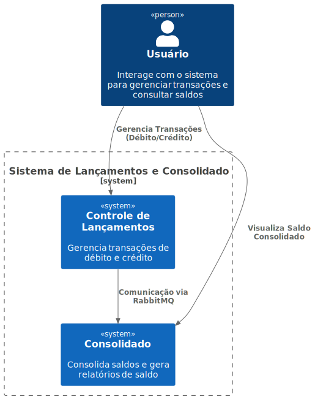
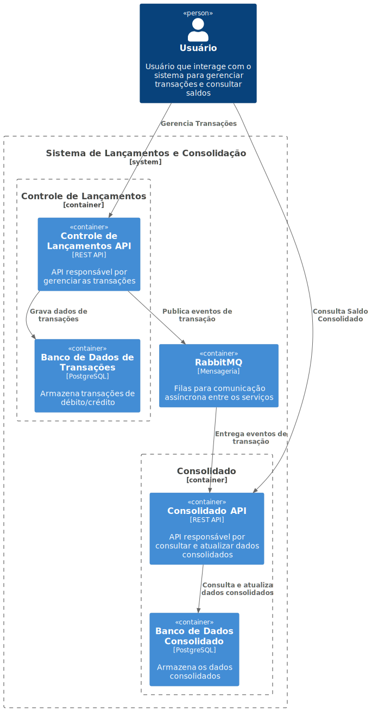
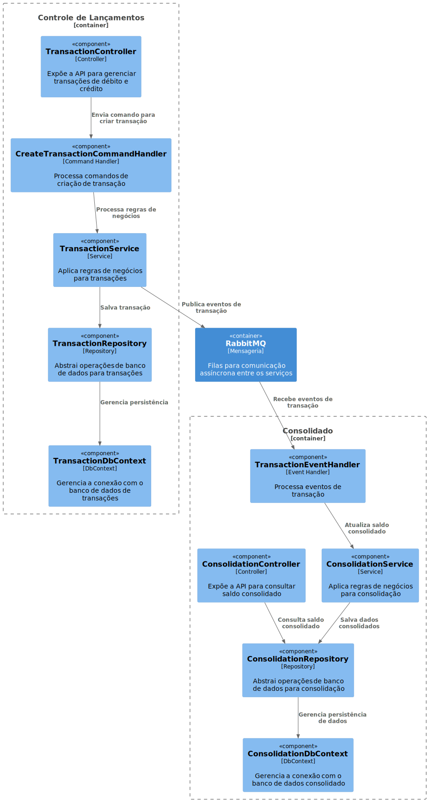

# Projeto de Controle de Lançamentos e Consolidação de Saldo 🚀

Este projeto implementa um sistema de controle financeiro para gerenciar lançamentos (débito e crédito) e fornecer relatórios consolidados de saldo diário. A arquitetura do sistema utiliza microsserviços, comunicação assíncrona e boas práticas de design e desenvolvimento, garantindo escalabilidade, resiliência e facilidade de manutenção.

## 🛠 Arquitetura e Design

A arquitetura é baseada no modelo de microsserviços, permitindo independência dos componentes e escalabilidade horizontal. Dois serviços principais foram desenvolvidos:

1. **Controle de Lançamentos** - Gerencia transações financeiras, permitindo o cadastro, consulta e atualização de lançamentos.
2. **Consolidado** - Consolida e calcula o saldo diário com base nas transações registradas no serviço de Controle de Lançamentos.

### 🏗 Princípios de Design e Padrões Adotados

O projeto adota os princípios SOLID e utiliza os seguintes padrões arquiteturais:
- **CQRS (Command Query Responsibility Segregation)**: Para separar comandos (ações) e consultas, mantendo uma organização clara e modular das operações.
- **Repository Pattern**: Fornece uma abstração para operações de banco de dados, facilitando a manutenção e o teste de código.
- **Event-Driven Architecture**: Utilização do RabbitMQ para comunicação entre serviços de forma assíncrona, garantindo que cada serviço seja resiliente a falhas nos outros.

### 🗂 Estrutura dos Projetos

#### **Controle de Lançamentos**
- **Responsabilidade**: Processar transações de débito e crédito.
- **Principais Componentes**:
  - `TransactionController`: Expõe a API para o gerenciamento de transações.
  - `CreateTransactionCommandHandler`: Processa o comando de criação de transação e aplica as regras de negócios.
  - `TransactionRepository`: Implementa o padrão Repository para encapsular operações de banco de dados.
  - **Banco de Dados**: PostgreSQL.
- **Estrutura de Pastas**:
  - `/src/Application`: Lógica de aplicação, incluindo Handlers e Interfaces.
  - `/src/Domain`: Entidades do domínio e regras de negócio.
  - `/src/Infrastructure`: Camada de infraestrutura, interações com banco de dados e RabbitMQ.
  - `/src/WebAPI`: API RESTful, incluindo Controllers e configuração da aplicação.

#### **Consolidado**
- **Responsabilidade**: Consolida e armazena o saldo diário com base nos lançamentos.
- **Principais Componentes**:
  - `ConsolidationController`: Fornece a API para consultar o saldo consolidado.
  - `TransactionEventHandler`: Processa eventos de transação via RabbitMQ e atualiza o saldo.
  - `ConsolidationRepository`: Acessa o banco de dados consolidado e executa as operações de atualização.
  - **Banco de Dados**: PostgreSQL.
- **Estrutura de Pastas**:
  - `/src/Application`: Manipulação de eventos e lógica de aplicação.
  - `/src/Domain`: Definição das entidades e regras do negócio.
  - `/src/Infrastructure`: Conexão com banco de dados e configuração de mensageria.
  - `/src/WebAPI`: Exposição das APIs REST.

## 🛠 Tecnologias Utilizadas

- **C# e ASP.NET Core (versão 6.0)**: Para construção de APIs com alta performance e robustez.
- **RabbitMQ (versão 3.9)**: Middleware para comunicação assíncrona entre serviços.
- **PostgreSQL (versão 13)**: Banco de dados relacional para armazenamento das transações e dados consolidados.
- **Docker e Docker Compose**: Para empacotamento e orquestração dos serviços.

## 📊 Diagramas de Arquitetura

Os diagramas a seguir foram gerados utilizando o C4 Model com PlantUML para descrever a arquitetura.

### Diagrama de Contexto



### Diagrama de Contêiner



### Diagrama de Componente



## 🚀 Executando o Projeto

O projeto é executado em contêineres Docker, o que facilita a configuração e a portabilidade dos ambientes. Todas as dependências e serviços são orquestrados usando Docker Compose.

### Pré-requisitos

- Docker (versão 20.10 ou superior)
- Docker Compose (versão 1.29 ou superior)

### Passo a Passo para Executar o Projeto

1. **Clone o repositório:**
   ```bash
   git clone https://github.dev/FlavioAndre/lancamentos
   cd lancamentos
   ```

2. **Construa e inicie os serviços com Docker Compose:**
   ```bash
   docker-compose up --build -d
   ```
   > O comando acima compilará as imagens de cada serviço (`controle_lancamentos` e `consolidado`) e iniciará todos os contêineres, incluindo o RabbitMQ e os bancos de dados PostgreSQL.

3. **Verifique o status dos serviços:**
   ```bash
   docker-compose ps
   ```
   Esse comando mostrará o status dos contêineres, incluindo as APIs e serviços de banco de dados.

4. **Acesse as APIs:**
   - **Controle de Lançamentos**: `http://localhost:8080/api/transactions`
   - **Consolidado**: `http://localhost:8081/api/consolidation`

### 🔍 Rodando os Testes

Para garantir que todas as funcionalidades estejam operacionais, há testes unitários e de integração disponíveis.

1. **Acesse o diretório do serviço** que deseja testar (por exemplo, `controle_lancamentos`):
   ```bash
   cd controle_lancamentos/tests
   ```

2. **Execute os testes** usando o comando:
   ```bash
   dotnet test
   ```
   Esse comando executará todos os testes unitários e fornecerá um relatório detalhado dos resultados.

## 📦 Futuras Melhorias e Evoluções

### 1. Autenticação e Autorização
- **Descrição**: Implementar OAuth2 para garantir a segurança dos dados sensíveis e proteger o acesso às APIs.
- **Benefícios**: Eleva o nível de segurança e permite um controle de acesso robusto, essencial para ambientes de produção.

### 2. Monitoramento e Alertas
- **Descrição**: Configurar o Prometheus e o Grafana para monitoramento contínuo dos serviços, bancos de dados e fila de mensagens.
- **Benefícios**: Fornece visibilidade em tempo real sobre o desempenho e a saúde dos serviços, permitindo respostas rápidas a incidentes.

### 3. Escalabilidade Horizontal e Failover
- **Descrição**: Implementar auto-scaling para lidar com aumento de carga, garantindo que o sistema possa escalar conforme necessário. Configurar o failover para o RabbitMQ e para os bancos de dados, garantindo continuidade em caso de falhas.
- **Benefícios**: Melhora a resiliência e a disponibilidade, especialmente em cenários de alta demanda.

### 4. Testes de Desempenho e Resiliência
- **Descrição**: Desenvolver uma suíte de testes de desempenho e resiliência utilizando ferramentas como JMeter ou Locust para simular cenários de alta carga e falhas.
- **Benefícios**: Garante que o sistema atenda aos requisitos de SLA (Service Level Agreement) e consiga manter sua estabilidade sob condições extremas.

### 5. Caching de Consultas
- **Descrição**: Implementar caching para consultas ao saldo consolidado, utilizando Redis ou outra tecnologia de cache.
- **Benefícios**: Acelera o tempo de resposta e reduz a carga no banco de dados, melhorando a experiência do usuário final.

## 📝 Conclusão

Este projeto foi estruturado conforme as melhores práticas de arquitetura de sistemas, com uma estrutura modular, escalável e resiliente. A aplicação dos princípios SOLID, dos padrões CQRS, Repository e arquitetura orientada a eventos reforça a qualidade do código e facilita a manutenção. As melhorias futuras propostas permitirão ao sistema atender a requisitos de segurança, monitoramento, escalabilidade e desempenho, alinhando-se às expectativas de produção e de ambientes empresariais.

