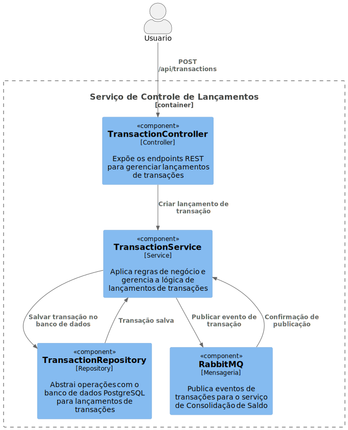

# Serviço de Controle de Lançamentos

Este serviço é responsável por gerenciar transações financeiras, permitindo o cadastro, consulta e atualização de lançamentos, incluindo operações de débito e crédito. O serviço é parte da arquitetura de microsserviços de um sistema financeiro maior, que inclui um serviço de consolidação de saldo.

## 📁 Funcionalidades

- **Criar Lançamento**: API para registrar uma nova transação de débito ou crédito.
- **Consultar Lançamentos**: Permite consultar transações específicas ou filtrar por critérios.
- **Publicar Eventos de Transação**: Envia eventos para o sistema de mensageria (RabbitMQ) para integração com o serviço de consolidação.

## 🚀 Tecnologias Utilizadas

- **C# e ASP.NET Core**: Framework para construção da API.
- **PostgreSQL**: Banco de dados relacional para persistência de dados.
- **RabbitMQ**: Sistema de mensageria para comunicação assíncrona com outros serviços.
- **Docker e Docker Compose**: Para contêinerização e orquestração dos serviços.

## ⚙️ Arquitetura e Principais Componentes

O serviço de Controle de Lançamentos segue uma estrutura baseada em princípios SOLID e utiliza padrões como CQRS e Repository.

### Componentes

- **Controllers**:
  - `TransactionController`: Expõe os endpoints REST para gerenciar transações.
  
- **Handlers**:
  - `CreateTransactionCommandHandler`: Processa o comando de criação de uma transação, aplicando validações e regras de negócio.

- **Services**:
  - `TransactionService`: Aplica regras de negócio e gerencia a lógica de transações.

- **Repositories**:
  - `TransactionRepository`: Abstrai operações com o banco de dados PostgreSQL.

- **DbContext**:
  - `TransactionDbContext`: Gerencia a conexão e o contexto com o banco de dados.

### Diagrama de Sequencia



## 🚀 Executando o Serviço

### Pré-requisitos

- Docker e Docker Compose (ou um ambiente configurado com .NET Core SDK e PostgreSQL).

### Instruções para Executar com Docker

1. **Clonar o Repositório**:
   ```bash
   git clone https://github.com/FlavioAndre/lancamentos.git
   cd lancamentos/controle_lancamentos
   ```

2. **Construir e Iniciar o Serviço**:
   ```bash
   docker-compose up --build -d
   ```
   Esse comando compilará a imagem do serviço e iniciará os contêineres necessários, incluindo PostgreSQL e RabbitMQ.

3. **Verificar o Status**:
   ```bash
   docker-compose ps
   ```

4. **Acessar o Serviço**:
   - API de transações: `http://localhost:8080/api/transactions`

### Executando Testes

1. **Acessar o Diretório de Testes**:
   ```bash
   cd tests
   ```

2. **Executar Testes**:
   ```bash
   dotnet test
   ```

Esse comando executará os testes unitários e de integração, fornecendo um relatório detalhado dos resultados.

## 📅 API Endpoints

- **POST /api/transactions**: Cria uma nova transação.
  - **Parâmetros**: `{ "amount": decimal, "type": "credit" | "debit", "description": "string" }`
  - **Resposta**: Confirmação da criação da transação.

- **GET /api/transactions**: Retorna uma lista de transações com filtros opcionais.

## 🛠️ Futuras Melhorias

- **Autenticação e Autorização**: Implementar OAuth2 para proteger os endpoints da API.
- **Melhoria na Resiliência de Mensageria**: Implementar políticas de retry e dead-letter para eventos enviados ao RabbitMQ.
- **Otimização de Consultas**: Implementar caching para consultas frequentes de transações.

